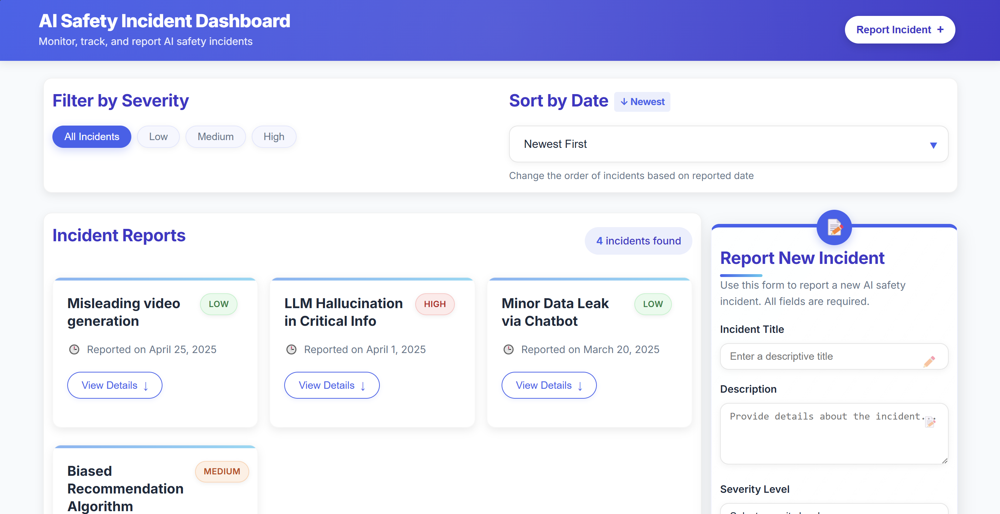

# 🛡️ AI Safety Incident Dashboard

A responsive and interactive dashboard for viewing, filtering, sorting, and reporting hypothetical AI safety incidents. Built with vanilla HTML, CSS, and JavaScript.

## 🚀 Features

- **View Incidents**: Browse through a list of AI safety incidents with details.
- **Filter by Severity**: Filter incidents by Low, Medium, or High severity.
- **Sort by Date**: Sort incidents by newest or oldest first.
- **Toggle Details**: Click "View Details" to show or hide incident descriptions.
- **Report New Incidents**: Submit new incidents via the form.
- **Responsive Design**: Works on mobile, tablet, and desktop devices.

## 🛠️ Setup Instructions

1. Clone or download this repository.
2. Open the `index.html` file in your web browser.
3. No build steps or dependencies required!

##📸 Screenshots
Below are some screenshots of the dashboard interface:
##🔷 Dashboard View



##🟨 Report New Incident Form


## 🧠 Optional Enhancements

To enable data persistence between sessions, uncomment the following lines at the bottom of `script.js`:

```javascript
// loadFromLocalStorage();
// window.addEventListener('beforeunload', saveToLocalStorage);
